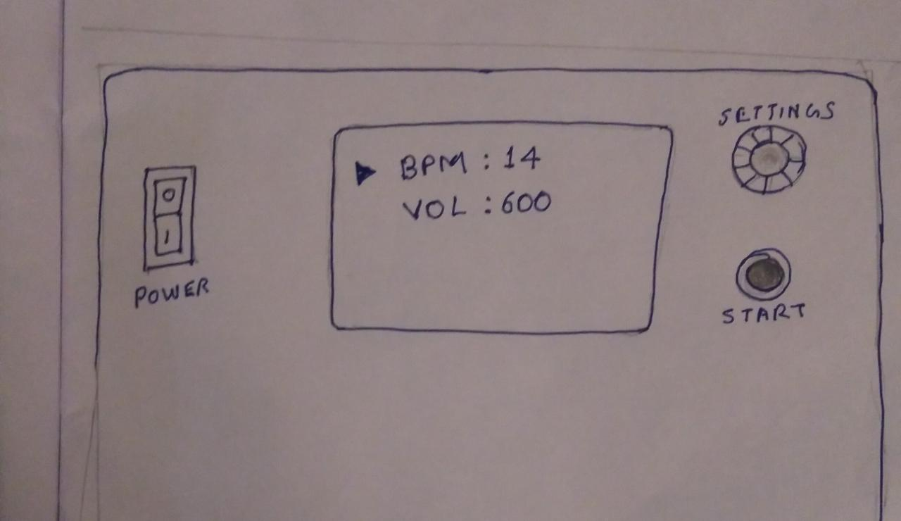
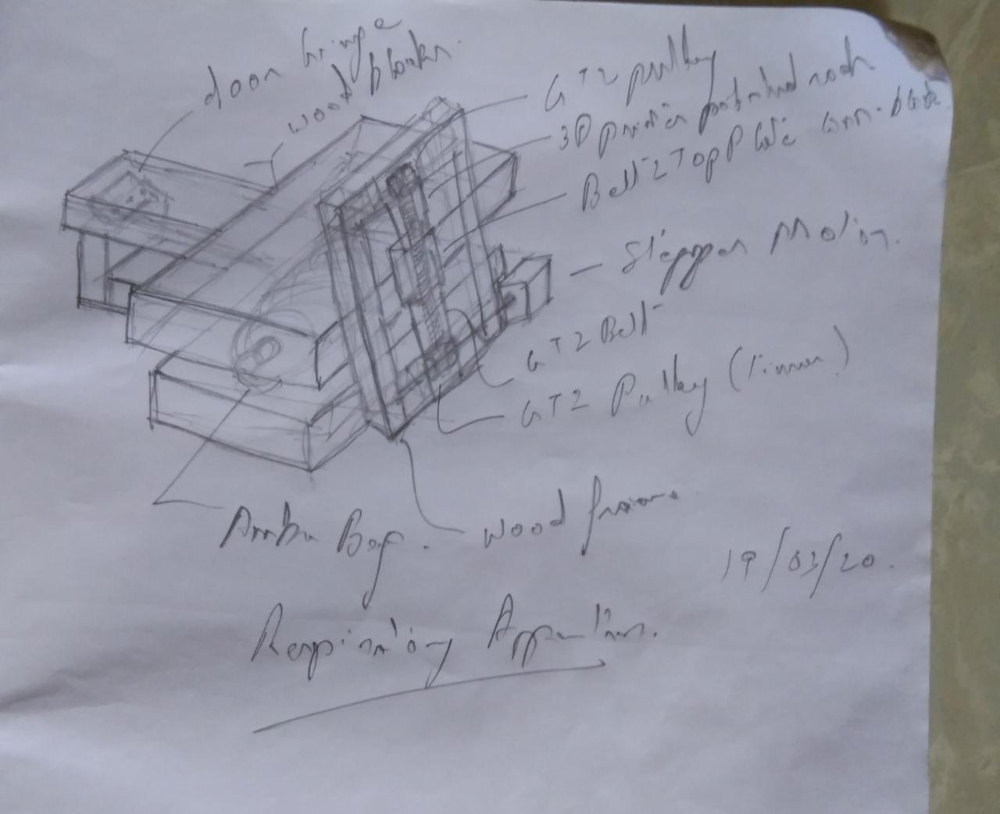
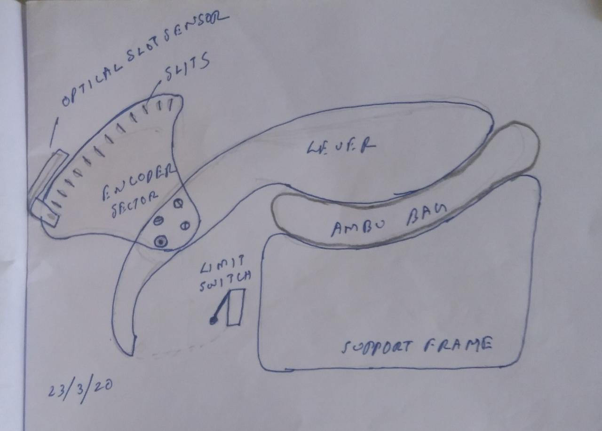
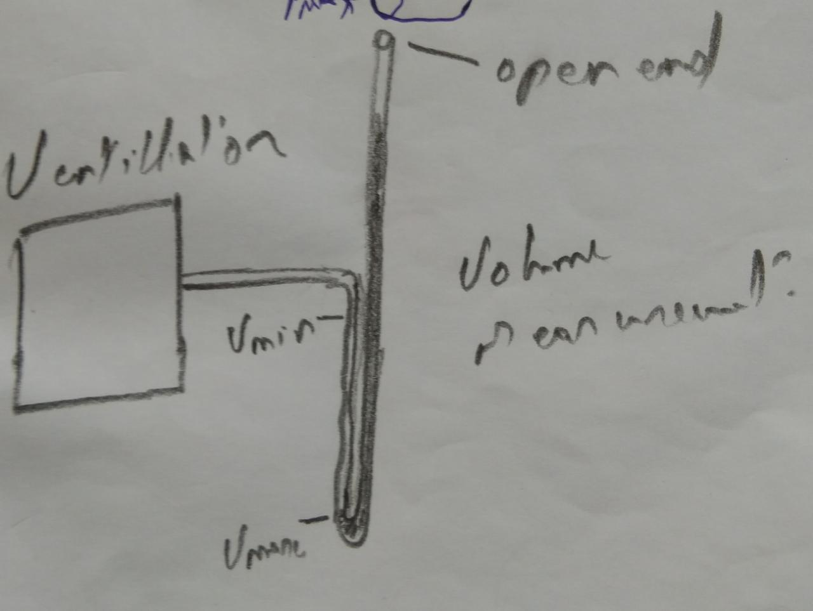

# Introduction

The RespiratorApparatus is a project to build a bare minimal respirator using BVMS.
It allows the intensivist to select Volume and BPM. PEEP valve of the BVM provides PEEP setting.
This project was conceived in the backdrop of the #COVID19 outbreak.

## Folder Structure

```txt
RespiratorApparatus
    |--docs 		     : all documents for code, electronics and mechanics.
    |--electronics	     : EDA files
    |--firmware		     : files for the firmware on the RespiratorApparatus
    |--mechanics	     : mechanical designs
	    |--models	     : CAD models
	    |--manufacturing : drawings and files for manufacturing
```

## Note to contributors

1. You may upload images in the docs folder but make sure the image size is less than 100K
2. Everytime you add a document, please add an entry below

## Rough concept of HMI



## The very first concept that we used as a seed for discussions



## Concept for position sensing and better shape of lever



## Outline for a volume measurement method for testing purposes



## [pseudocode for firmware](pseudocode.txt )
